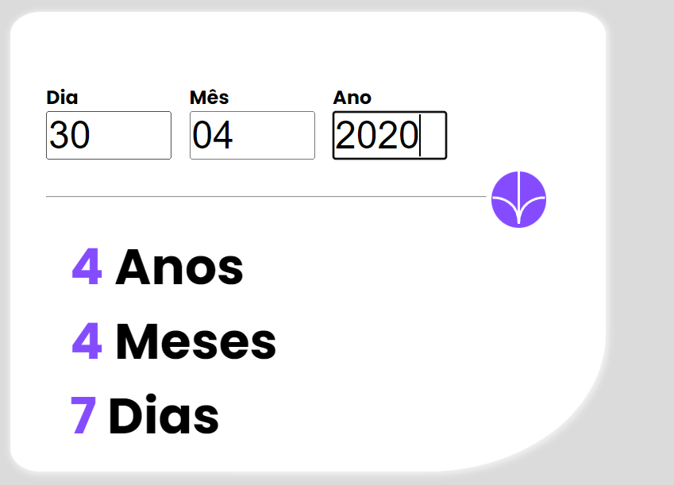
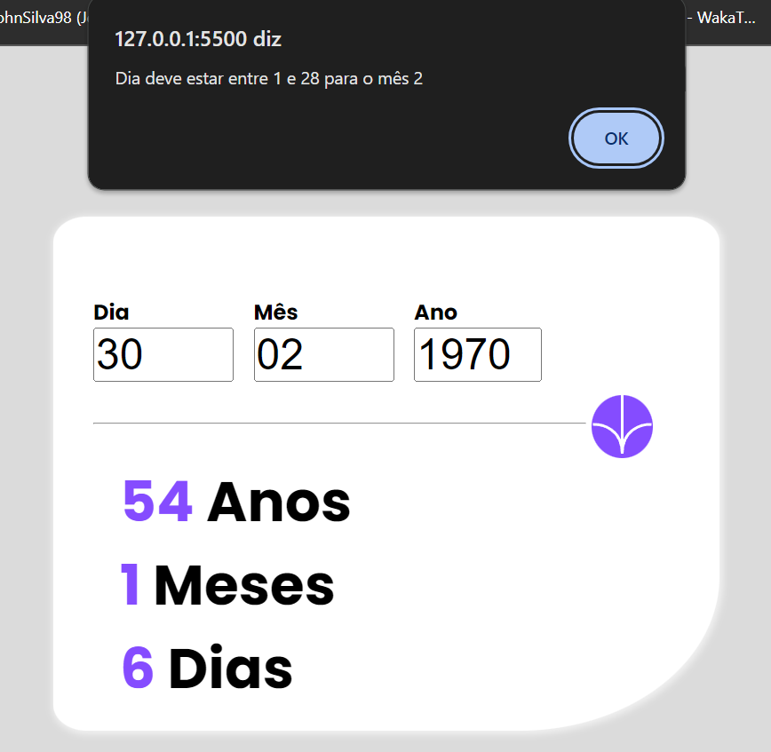

## Indice

- [Frontend Mentor - Age calculator app solution](#frontend-mentor---age-calculator-app-solution)
  - [Table of contents](#table-of-contents)
    - [O desafio](#o-desafio)
    - [Screenshot](#screenshot)
    - [Links](#links)
    - [Construído com](#construído-com)

### O desafio

Objetivo - Ver a idade em anos, meses e dias depois de colocar a data de nascimento

receber erros de validação se:

- qualquer campo estiver vazio
- o dia nao for um numero entre 1 e 31
- o mes nao for um dia entre 1 e 12
- a data esta no futuro
- data invalida ( 31/04 - abril tem 30 dias)

### Screenshot

### Links

- Link da Solução: [(https://www.frontendmentor.io/solutions/age-calculator-app-7Y0r4enG_q](FrontendMentor)
- Link do projeto: [https://calc-ageapp.vercel.app/](Vercel)

### Construído com

- Semantic HTML5 markup
- CSS custom properties
- JavaScript

- Website - [Portfólio](https://jonathan-silva.vercel.app/)
- Frontend Mentor - [@JohnSilva98](https://www.frontendmentor.io/profile/JohnSilva98)
